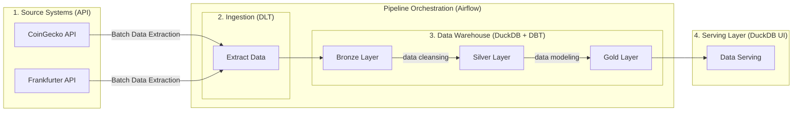

# Crypto Tracker

> A complete, runnable data engineering project: daily crypto prices and FX
> rates, ingested with dlt, warehoused in DuckDB, modelled with dbt into a
> medallion + star schema, orchestrated by Airflow 3 — all on your laptop, with
> no API keys and no cloud account.

- **Runs entirely locally.** One DuckDB file, one virtualenv, one DAG.
- **Zero credentials.** CoinGecko's free tier and Frankfurter are both keyless.
- **Every non-obvious decision is documented in-code.** Why the pool has one
  slot, why dlt splits price columns without a `Decimal` cast, why the FX
  spine is forward-filled — each is a comment in the file it shapes.
- **Built to be taught from.** The repository doubles as a workshop for people
  new to data engineering; see [docs/workshop.md](docs/workshop.md).

[](LICENSE)
[](.python-version)
[](pyproject.toml)
[](pyproject.toml)
[](pyproject.toml)

## Architecture at a glance



| Layer | Materialization | Contents |
|---|---|---|
| **bronze** | dlt tables + dbt views | dlt's landing zone (source tables, `_dlt_*` bookkeeping, `bronze_staging`) plus dbt's `br_*` trust-filter views over it. |

## What you get

After a successful first run:

- **10 cryptocurrencies** × **365 days** of daily history (CoinGecko free tier)
- **9 reporting currencies** — USD base plus 8 ECB quotes
- **18 dbt models** across 3 layers (4 bronze / 4 silver / 10 gold)
- **75 declared data tests** (51 `not_null`, 16 `relationships`, 7 `unique`, 1
  `accepted_values`)
- **One DuckDB file** (~12 MB) at `data/crypto.duckdb`

## Prerequisites

| Tool | Why | Install (macOS) | Install (Windows) | Install (Ubuntu/Debian) |
|---|---|---|---|---|
| `uv` | Creates the venv, installs the pinned stack, and runs every command below | `brew install uv` | `winget install astral-sh.uv` | `curl -LsSf https://astral.sh/uv/install.sh \| sh` (or `sudo apt install uv` after [adding the uv apt repo](https://docs.astral.sh/uv/getting-started/installation/)) |
| `git` | Cloning the repo | `xcode-select --install` (bundled with the Xcode Command Line Tools) | `winget install Git.Git` (or install [Git for Windows](https://git-scm.com/download/win)) | `sudo apt install git` |

On macOS, the two rows above cost **one** install: `xcode-select --install`
provides `git`, leaving `uv` as the only separate tool. The recommended form
for every command below is `uv run ct <command>`; the raw `dlt`/`dbt`/`airflow`
forms that the workshop teaches live in [Commands — classic](#classic-commands).
The DuckDB engine arrives as the pinned `duckdb==1.5.5`
Python package inside the venv, so no separate database install is needed.

No API keys. The pipeline uses CoinGecko's keyless free tier and Frankfurter's
public ECB endpoint. Copy `.env.example` only if you want to change the tracked
coin or currency lists (see [Configuration](#configuration)).

## Setup — first run

```bash
git clone <repo-url> && cd crypto-tracker

uv run ct setup          # creates .venv (Python 3.11) and installs the pinned stack — ~1-2 min
uv run ct airflow-init   # creates the Airflow metadata DB and the 1-slot duckdb_writer pool
uv run ct run            # ingest + build; ~4 min on the first run (365 days, rate-limit paced)
uv run ct tables         # confirm: rows across bronze / silver / gold
uv run ct portfolio      # confirm: portfolio value and P&L in all 9 currencies
```

> **Why is the first `uv run ct run` slow?** Because of CoinGecko's keyless rate
> limit, not because the pipeline is slow: one history request per coin, paced
> 3 s apart, plus a single ECB FX request. Subsequent runs fetch only a 2-day
> crypto window and a 7-day FX window and finish in seconds.

> `uv run ct` with no subcommand prints the grouped command list. That output
> is the only command list you need to memorise.

A full database rebuild (4 minutes + a clean slate) is `uv run ct clean-db`. To
also drop dbt artifacts and the Airflow metadata DB, use `uv run ct clean`.

The classic-form equivalents of every `uv run ct` command (the raw `dlt`,
`dbt`, `airflow`, and DuckDB invocations that the workshop teaches) live in
[Commands — classic](#classic-commands).

## Configuration

`uv run ct` already exports every variable in `.env.example`, so a copy is
needed **only** when you want to change the defaults or run commands outside
`uv run ct`.

```bash
cp .env.example .env
```

| Variable | Default | Notes |
|---|---|---|
| `CRYPTO_TRACKED_COINS` | 10 coins (bitcoin, ethereum, solana, cardano, ripple, polkadot, chainlink, dogecoin, avalanche-2, litecoin) | More coins = more per-coin history requests. Use CoinGecko slugs, not tickers (e.g. `avalanche-2`, not `AVAX`). |
| `CRYPTO_FIAT_CURRENCIES` | 8 ECB codes (EUR, GBP, JPY, IDR, SGD, AUD, CHF, CAD) | Must be in ECB's set, or Frankfurter returns 422. |
| `BASE_CURRENCY` | `USD` | Reporting base. Add it to `CRYPTO_FIAT_CURRENCIES` if you want to value the portfolio in USD. |
| `CRYPTO_LOG_LEVEL` | `INFO` | `DEBUG` shows every dlt request and retry. |

## Commands

Every command in this repo exists in two forms that run exactly the same
subprocesses:

- **Classic form** — the raw `python -m` (dlt), `dbt`, `airflow`, and DuckDB
  invocations. The workshop ([docs/workshop.md](docs/workshop.md)) teaches
  this form so every seam of the pipeline is visible.
- **Shortcut form** — `uv run ct <subcommand>`: the repo's thin wrapper
  ([scripts/cli.py](scripts/cli.py)) that runs the same commands with the
  environment (venv, `AIRFLOW_HOME`, `CRYPTO_DB_PATH`, `PYTHONPATH`, `.env`)
  already set.

### Classic commands

Set these once per shell, then run any row from the table below:

```bash
source .venv/bin/activate        # dbt + airflow + python on PATH
export AIRFLOW_HOME="$PWD/.airflow" AIRFLOW__CORE__LOAD_EXAMPLES=False PYTHONPATH="$PWD"
# for the dbt rows only, from transform/:
export CRYPTO_DB_PATH="$PWD/../data/crypto.duckdb"
```

| Task | Classic command (from `docs/workshop.md`) |
|---|---|
| first-time setup | `uv sync` |
| init Airflow metadata + pool | `airflow db migrate && airflow pools set duckdb_writer 1 "Serializes DuckDB write access"` |
| ingest (dlt) | `python -m ingest.run_ingest` |
| dbt build | `cd transform && export CRYPTO_DB_PATH="$PWD/../data/crypto.duckdb" && dbt build --profiles-dir . && cd ..` |
| dbt tests only | `dbt test --profiles-dir .` (from `transform/`) |
| dbt full refresh | `dbt build --full-refresh --profiles-dir .` (from `transform/`) |
| dbt lineage docs | `dbt docs generate --profiles-dir . && dbt docs serve --port 8081 --profiles-dir .` (from `transform/`) |
| list tables | `python -m scripts.duckdb_cli tables` |
| portfolio | `python -m scripts.duckdb_cli portfolio` |
| performance | `python -m scripts.duckdb_cli performance` |
| SQL shell (RO) | `python -m scripts.duckdb_cli shell --readonly` |
| SQL shell (RW) | `python -m scripts.duckdb_cli shell` |
| one-shot SQL | `python -m scripts.duckdb_cli sql "<query>"` |
| lock probe | `python -m scripts.duckdb_cli check-lock` |
| Airflow UI | `airflow standalone` |
| admin creds | `cat "$AIRFLOW_HOME/simple_auth_manager_passwords.json.generated"` |
| DAG test (no scheduler) | `airflow dags reserialize && airflow dags test crypto_tracker_daily` |
| DAG trigger | `airflow dags trigger crypto_tracker_daily` |
| DAG run history | `airflow dags list-runs crypto_tracker_daily` |
| unpause / pause | `airflow dags unpause crypto_tracker_daily` / `airflow dags pause crypto_tracker_daily` |
| clean warehouse + dlt state | `rm -f data/crypto.duckdb data/crypto.duckdb.wal && rm -rf ~/.dlt/pipelines/crypto_tracker` |
| drop dbt artifacts + Airflow metadata | `rm -rf transform/target transform/logs .airflow` |

### Shortcut commands

Same commands, one prefix. `ct` activates nothing — it invokes the venv
binaries directly and sets `AIRFLOW_HOME`, `CRYPTO_DB_PATH`, `PYTHONPATH`, and
loads `.env` automatically (see [scripts/cli.py](scripts/cli.py)). `uv run ct`
with no subcommand prints the grouped list.

| Command | Does |
|---|---|
| `uv run ct run` | ingest + rebuild everything |
| `uv run ct ingest` | load CoinGecko + FX into `bronze` only |
| `uv run ct dbt` | build + test silver and gold (no re-ingest) |
| `uv run ct dbt-refresh` | full-refresh rebuild of the incremental facts |
| `uv run ct test` | run dbt tests only, without rebuilding |
| `uv run ct tables` | every table and view with row counts |
| `uv run ct portfolio` | portfolio value and P&L in all 9 currencies |
| `uv run ct performance` | trailing returns and volatility per coin (USD) |
| `uv run ct ui` | browser SQL notebook on <http://localhost:4213> |
| `uv run ct query` | read-write DuckDB SQL shell |
| `uv run ct query-ro` | read-only DuckDB SQL shell |
| `uv run ct airflow-ui` | scheduler + Airflow UI on <http://localhost:8080> |
| `uv run ct creds` | the Airflow admin password |
| `uv run ct dag-test` | run the DAG end-to-end without a scheduler |
| `uv run ct trigger` | trigger a DAG run now (needs the scheduler running) |
| `uv run ct status` | last 5 DAG runs and their task states |
| `uv run ct unpause` / `pause` | enable / disable the daily schedule |
| `uv run ct docs` | generate and serve the dbt lineage docs on <http://localhost:8081> |
| `uv run ct clean-db` | delete the warehouse and dlt state (forces a full re-ingest) |
| `uv run ct clean` | clean-db plus dbt artifacts and Airflow metadata |

## Exploring the data

```bash
uv run ct tables     # every table + row count, non-interactive
uv run ct ui         # browser SQL notebook + schema browser on :4213
uv run ct query-ro   # read-only DuckDB shell
```

`uv run ct ui` is the easiest starting point: it opens a browser IDE on
<http://localhost:4213> with a clickable schema tree and query editor. Open
`analysis_gold.sql` directly in the UI to run the eight curated analyses
(portfolio executive summary; holdings & asset allocation; historical
trajectory & rolling drawdown; coin performance & volatility matrix;
risk-adjusted momentum; market breadth & sentiment; multi-currency FX
sensitivity; intraday liquidity & 24 h spread).

**Quit your client before the pipeline runs.** DuckDB is single-writer and the
lock is mutually exclusive in *both* directions, which is stricter than most
people expect:

| You hold | Pipeline wants | Result |
|---|---|---|
| read-write shell or UI | to write | blocked |
| **read-only** shell | to write | **blocked** |
| nothing | to write | fine |

Even a read-only client blocks the writer, so an open `uv run ct ui` will make the
next Airflow run fail with `Could not set lock on file`. Press Ctrl-D to quit.
See [docs/TROUBLESHOOTING.md](docs/TROUBLESHOOTING.md) for the full diagnosis.

`uv run ct tables` is the exception worth knowing: it opens, prints, and exits
immediately, so it is safe to run any time the pipeline is not mid-task.

`uv run ct ui` opens the warehouse **read-write** because the UI extension stores
its own notebooks and query history in a `_duckdb_ui` catalog, and opening
read-only fails with `Binder Error: Catalog "_duckdb_ui" does not exist!`.
Use `uv run ct query-ro` when you want a guaranteed read-only session.

Any DuckDB-aware client works too: point it at `data/crypto.duckdb` and enable
read-only if the client offers it. The same "quit before the pipeline runs"
rule applies.

## Example queries

```sql
-- Portfolio value and P&L in every tracked currency, latest day
select currency_code, round(total_value_local, 2), round(total_unrealized_pnl_pct, 2)
from gold.mart_portfolio_summary
where price_date = (select max(price_date) from gold.mart_portfolio_summary);

-- Trailing returns and 30-day volatility per coin
select symbol, latest_price_usd, return_7d_pct, return_30d_pct, volatility_30d_pct
from gold.mart_coin_performance
where currency_code = 'USD'
order by return_30d_pct desc;

-- Market breadth over time
select price_date, advancing_coins, declining_coins, top_gainer_coin_id
from gold.mart_market_overview
where currency_code = 'USD'
order by price_date desc limit 10;
```

For the long-form analyses (drawdown, Sharpe-like momentum, FX sensitivity,
intraday spread) see `analysis_gold.sql`.

## Repository layout

```
.
├── ingest/               # dlt sources: CoinGecko + Frankfurter
├── transform/
│   ├── models/
│   │   ├── bronze/       # 4 views, dlt-load-filtered
│   │   ├── silver/       # 4 views (one table for the FX spine)
│   │   └── gold/         # 10 tables: dims, facts, marts
│   ├── macros/           # generate_schema_name, money/fx_rate/position_value
│   ├── seeds/            # portfolio_holdings.csv
│   └── tests/            # singular dbt tests (e.g. assert_no_future_price_dates)
├── dags/                 # Airflow 3 DAG: ingest_raw >> dbt_build
├── docs/                 # ARCHITECTURE, WORKSHOP, TROUBLESHOOTING
├── analysis_gold.sql     # 8 curated analyses on the gold layer
├── data/                 # gitignored: the DuckDB file lives here
├── .airflow/             # gitignored: Airflow metadata
├── scripts/              # ct entry point + duckdb_cli helpers
├── pyproject.toml        # pinned stack + ct console script
├── .env.example          # environment variables (no secrets)
└── LICENSE               # MIT
```

## Documentation

- [docs/ARCHITECTURE.md](docs/ARCHITECTURE.md) — the reference document for
  *why the code looks like this*: layers, trust boundary, star schema, join
  discipline, hard-won constraints.
- [docs/workshop.md](docs/workshop.md) — a guided walkthrough for new data
  engineers: nine modules, nine exercises, solutions included.
- [docs/TROUBLESHOOTING.md](docs/TROUBLESHOOTING.md) — symptom → cause → fix
  for every failure mode observed against the live APIs and DuckDB.

## Workshop

This repository doubles as a workshop for people new to data engineering.
Prerequisites: comfortable with SQL basics (`select`, `join`, `group by`) and a
terminal. No prior dbt, dlt, Airflow, dimensional-modelling, or cloud
experience is assumed. See [docs/workshop.md](docs/workshop.md).

The default walkthrough ([docs/workshop.md](docs/workshop.md)) uses the
underlying tools directly — `dlt`, `dbt`, `airflow`, `duckdb` — so you can see
every command the pipeline runs. A ct-based twin that wraps the same flow in a
`uv run ct <subcommand>` helper is available at
[docs/WORKSHOP_WITH_CT.md](docs/WORKSHOP_WITH_CT.md) for participants who
prefer one-command ergonomics.

## Contributing

Issues and PRs are welcome. The project's house style is: every non-obvious
decision in the code carries a comment explaining *why* (the variant-column
trap, the single-writer pool, the forward-filled FX spine, the
`DECIMAL(38,18) × DECIMAL(38,18)` overflow). When adding a model, a macro, or
a target, follow that pattern. Before opening a PR, run `uv run ct test` and
confirm it reports `Done. PASS=… WARN=0 ERROR=0 SKIP=0`.

## License

[MIT](LICENSE).
