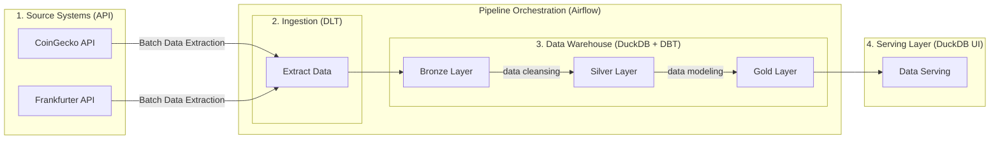

# Architecture

This document explains *why the code looks like this* — the constraints, decisions, and hard-won knowledge that shaped the design.

## Pipeline overview



The `ingest_raw` task (retries 3, delay 5 min) extracts from CoinGecko and
Frankfurter into `bronze`, then the `dbt_build` task (retries 1, delay 2 min)
`duckdb_writer` pool — a 1-slot gate that serialises all writes to the DuckDB
file. This is a correctness mechanism, not a performance tweak.

## Why ELT, not ETL

**Land first, transform second.** The dlt tables in `bronze` are byte-faithful
to the APIs: one table per endpoint (`coins_markets_raw`,
`coin_market_chart_raw`, `fx_rates_raw`), with every field the API returned.
If a transformation breaks, or an algorithm changes, or a downstream test
fails, you can re-run the transformation without re-hitting the rate-limited
APIs.

The medallion pattern (`bronze` → `silver` → `gold`) then layers the
transformation:

- **Bronze** filters to complete loads and standardizes types.
- **Silver** deduplicates, joins, and fills gaps.
- **Gold** conforms to the dimensional model and computes derived facts.

None of this rewrites the dlt tables.

## The medallion layers

### Bronze (dlt landing zone + dbt trust-filter views)

`bronze` is both dlt's landing zone and the first dbt layer, sharing one
schema. dlt owns the source tables (`coins_markets_raw`, `coin_market_chart_raw`,
`fx_rates_raw`) and its bookkeeping:

- `_dlt_loads` — every load attempt, with its status.
- `_dlt_version` — schema versions.
- `_dlt_pipeline_state` — the state that dlt uses to resume after failure.
- `bronze_staging` — temporary tables used during merge loads.

The bookkeeping tables belong to the same dlt dataset as the source tables, so
they must live in the same schema. Rather than isolate them behind an extra
`raw` layer, dlt lands in `bronze` directly and dbt adds four trust-filter
views alongside:

- `br_completed_loads` — a list of the load IDs that reached `status = 0`.
- `br_coins_markets` — `coins_markets_raw` filtered to completed loads.
- `br_coin_market_chart` — `coin_market_chart_raw` filtered to completed loads.
- `br_fx_rates` — `fx_rates_raw` filtered to completed loads.

An interrupted run leaves rows whose load never completed. **Every bronze
view inner-joins `br_completed_loads`** to exclude those rows, ensuring
downstream facts never contain partial or stale data.

Materializing bronze as views is correct: each is a thin filter over a dlt
table, and views occupy no disk space (unlike a physical materialisation which
would duplicate the whole landing zone). Object-name convention keeps the two
owners apart: dlt owns `*_raw` and `_dlt_*`, dbt owns `br_*`; the yml source
declarations live in `transform/models/sources/`, separate from the dbt
models in `transform/models/bronze/`.

### Silver (dbt views + one table)

Four models that clean, deduplicate, and prepare data for the star schema:

- `stg_coin_snapshots` — API snapshot deduped to one row per (coin, timestamp).
- `stg_coin_prices_daily` — daily prices with `price_date < current_date` filter
  (CoinGecko finalises a day only after it closes) and deduped to one per
  (coin, date).
- `stg_fx_rates` — (rate_date, base_currency, quote_currency) grain, plus a
  synthetic USD→USD identity row so USD reporting takes the same join path as
  any other currency.
- `stg_fx_rates_filled` — `stg_fx_rates` forward-filled across ECB gaps on a
  calendar-day spine. **This model overrides the folder default and is
  `materialized='table'`** because every downstream mart does a cross join
  across it for multi-currency reporting. Materialising it saves recomputation.

### Gold (dbt tables)

Ten tables split into three groups:

**Dimensions** (one row per unique entity):

- `dim_coin` — one per coin, with first/last price dates, history count, and
  active status.
- `dim_currency` — one per currency (discovered from FX data, not hard-coded).
- `dim_date` — one per calendar day, spanning the price history + 1 year
  (future space for forecasts or incremental updates).

**Facts** (grain-identified, grain-defining joins):

- `fct_coin_price_daily` — (coin, date), the core fact. Incremental,
  `delete+insert` strategy, reaching back 7 days.
- `fct_coin_snapshot` — (coin, timestamp), intraday state. Incremental,
  `delete+insert`.
- `fct_fx_rate_daily` — (date, currency), gapless.

**Datamarts** (business-facing views over the star schema):

- `mart_portfolio_value_daily` — (holding, date, currency), the valuation.
- `mart_portfolio_summary` — (date, currency), aggregates the per-holding mart.
- `mart_coin_performance` — (coin, currency), trailing returns and volatility.
- `mart_market_overview` — (date, currency), market breadth and sentiment.

## Why dlt and dbt share the `bronze` schema

dlt binds one dataset per pipeline. The source tables (`*_raw`), dlt's
bookkeeping (`_dlt_loads`, `_dlt_version`, `_dlt_pipeline_state`), and the
`<dataset>_staging` merge schema all land in the same dataset and cannot be
split across schemas. An earlier version of this project paid for that
constraint with a separate `raw` layer that existed only to isolate ~4
bookkeeping tables from dbt.

The simpler design: point dlt at `bronze` directly, and let the dbt `br_*`
views sit in the same schema alongside the dlt tables. Separation is by
object-name convention rather than by schema — dlt owns `*_raw` and `_dlt_*`
(never modelled by hand), dbt owns `br_*` (the trust-filter views), and the
ymls declaring the dlt source are parked in `transform/models/sources/`
separate from the dbt models in `transform/models/bronze/`.

## The `br_completed_loads` trust boundary

dlt writes rows to a table *before* it marks the load successful. An
interrupted run — a network error, an OOM, a manual kill — leaves rows whose
load never reached `status = 0`. Those rows are orphaned and must be excluded.

Every bronze model inner-joins the model `br_completed_loads`:

```sql
    select load_id from bronze._dlt_loads where status = 0
)
select *
from bronze.coins_markets_raw
inner join completed_loads
    on _dlt_load_id = load_id
```

The magic number `status = 0` (meaning success) is asserted in exactly one place:
the `br_completed_loads` model. Every other join names `load_id` correctly.

**Watch the column names:** dlt uses `_dlt_loads.load_id` (underscore prefix),
but `coins_markets_raw._dlt_load_id` (suffix). The join must be explicit about
which name is which.

## Star schema

### Grains and surrogate keys

Every dimension and fact table specifies its grain — the unique key of a row:

- `dim_coin`: grain is `coin_id` (one row per coin).
- `fct_coin_price_daily`: grain is (coin_id, price_date) (one row per coin per
  day).
- `mart_portfolio_value_daily`: grain is (holding_id, date_key, currency_key)
  (one row per holding per day per currency).

Surrogate keys are `cast(md5(natural_key) as varchar)`. Example from
`dim_coin.sql`:

```sql
select
    cast(md5(latest_attributes.coin_id) as varchar) as coin_key,
    ...
```

Identical computation in `fct_coin_price_daily.sql`:

```sql
select
    cast(md5(coin_id) as varchar) as coin_key,
    ...
```

Why md5 instead of a sequence? Because md5 is **deterministic across full
refreshes**. If the dim is rebuilt from scratch, the same coin gets the same
key. A sequence would emit new keys every time, breaking all downstream joins.

Date keys are `cast(strftime(date, '%Y%m%d') as integer)` — a compact integer
`YYYYMMDD` that fits in 4 bytes and is comparable.

### Join discipline

Three join types, each for a different reason:

**Inner joins** are **grain-defining**: they fix the row count and shape of the
fact. Example from `mart_portfolio_value_daily.sql`:

```sql
from holdings
inner join {{ ref('fct_coin_price_daily') }} as prices
    on prices.coin_id = holdings.coin_id
    and prices.price_date >= holdings.acquired_date
```

This join expands one holding into one row per day it was held. If a day has no
price, the holding has no valuation — inner join is correct.

**Left joins** are **attribute lookups**: the fact side is the anchor, and any
lookup that silently drops a row masks a data quality issue. Example:

```sql
left join {{ ref('dim_coin') }} as dim_coin
    on dim_coin.coin_key = converted.coin_key
```

If a coin_key has no matching dimension row, a NULL label surfaces the
relationships test failure. The row itself is not dropped.

**Cross joins** are **broadcast of single-row CTEs** and deliberate **fan-out**
across reporting currencies. From `fct_fx_rate_daily` cross join with the
calendar spine:

```sql
select ... from calendar
cross join currencies
```

Every calendar day gets every currency, ready for a left join to actual rates.

## Incremental models

`fct_coin_price_daily` and `fct_coin_snapshot` are `materialized='incremental'`
with `incremental_strategy='delete+insert'`.

Why not `merge`? Because daily facts are **whole-day partitions** — every date's
rows are either fully reprocessed or not at all. A merge strategy would be
overkill; delete+insert is simpler and faster.

Why reach back 7 days in the incremental filter?

```sql
where price_date >= (
    select coalesce(max(price_date) - interval 7 day, date '1970-01-01')
    from {{ this }}
)
```

The window function `lag(price_usd) over (partition by coin_id order by price_date)`
computes `price_change_usd` and `daily_return_pct`. If the incremental window
only fetches 2 new days, `lag()` would have no preceding row and would emit NULL.
By reaching back 7 days, the prior rows are present, and `lag()` returns real
values. The 7-day overlap is then deleted+reinserted (complete replacement), so
no duplicates escape.

## Data quality

### Tests

75 declared tests across 19 YAML files:

- **51 `not_null`** — every grain key and core attribute is non-null.
- **16 `relationships`** — every surrogate key in a fact joins to its dimension.
- **7 `unique`** — every grain key (surrogate + natural) has no duplicates.
- **1 `accepted_values`** — holdings have a known `coin_id`.

These are all built-in dbt generics. No `packages.yml` exists — adding
`dbt_utils` is a deliberate future choice, not an oversight.

The singular test `transform/tests/assert_no_future_price_dates.sql` asserts
that `fct_coin_price_daily.price_date < current_date`, enforcing the upstream
filter.

### Source freshness

`bronze.coins_markets_raw` declares freshness:

```yaml
loaded_at_field: _ingested_at
warn_after: {count: 26, period: hour}
```

If a load older than 26 hours is the freshest, `dbt source freshness` warns. In
production, this would trigger an alert.

## Orchestration

The DAG `crypto_tracker_daily` is Airflow 3, using the new authoring syntax:

```python
from airflow.sdk import Asset, dag, task
```

Not the legacy `@dag` from `airflow.decorators` and not `Dataset` — the new SDK
API is simpler and more explicit.

The DAG schedule is `"0 2 * * *"` — 02:00 UTC. CoinGecko finalises the previous
UTC day around 00:10 UTC, so 02:00 gives enough window for the API to settle.

`catchup=False` because both CoinGecko and Frankfurter serve a rolling current
window. If the DAG is paused for a week and then unpaused, replaying the
intervening logical dates would re-fetch the same data (CoinGecko has no
historical backfill beyond 365 days, and the data for old dates never changes).

`max_active_runs=1` and `max_active_tasks=1` prevent overlapping runs. Combined
with the 1-slot `duckdb_writer` pool, this guarantees serialised write access.

### The pool is correctness, not performance

DuckDB allows **only one writing process at a time**, and a held write lock
rejects even read-only connections from other processes. Airflow tasks are
separate processes. Without the pool gate, `ingest_raw` and `dbt_build` would
collide on the file and one would crash with:

```
IO Error: Could not set lock on file ... Conflicting lock is held in ...
```

The 1-slot pool is not a throughput optimisation — it is a **correctness
mechanism**. It ensures no two tasks write simultaneously.

## Hard-won constraints

These were discovered empirically against the live APIs and DuckDB. Every
constraint is a comment in the code.

### 1. DuckDB is single-writer

(See [Orchestration](#orchestration).) A held write lock blocks even read-only
connections from other processes. The 1-slot `duckdb_writer` pool enforces
serialisation. See `dags/crypto_tracker_daily.py` (docstring) and the lock
explanation at the top of `scripts/duckdb_cli.py` for details.

### 2. dlt splits price columns into variant columns

CoinGecko returns `current_price` as a whole number for bitcoin (e.g. `45000`)
and a decimal for ethereum (e.g. `2345.67`). dlt infers the first row's type
(BIGINT) and then diverts later rows into a `current_price__v_double` variant
column, so `select current_price` returns NULL for half the coins.

Declarative `columns` hints alone do *not* prevent this; values must be
`Decimal` before dlt inspects them. The fix is in `ingest/coingecko.py`:

```python
def _to_decimal(value: Any) -> Decimal | None:
    if value is None:
        return None
    return Decimal(str(value))  # via str to avoid binary float error

def _coerce_numerics(row: dict[str, Any], fields: list[str]) -> dict[str, Any]:
    for field in fields:
        row[field] = _to_decimal(row[field])
    return row
```

Every numeric field is coerced before dlt sees it.

### 3. ECB does not publish on weekends

Frankfurter returns ~255 dates per 365-day year (only TARGET business days).
Crypto trades every day. Joining daily crypto facts to published FX rates
yields NULL on every weekend and holiday.

`transform/models/silver/stg_fx_rates_filled.sql` solves this by:

1. Building a calendar spine from the crypto price history (every date a crypto
   price exists).
2. Joining published FX rates to the spine with a `left join` (many NULLs on
   weekends).
3. Forward-filling with `last_value(...ignore nulls) over (...)` (carrying the
   last published rate forward).
4. Flagging filled rows with `is_filled` (true for carried-forward rows).

Without this, every weekend valuation would be NULL.

### 4. `DECIMAL(38,18) × DECIMAL(38,18)` overflows

In DuckDB, multiplying two `DECIMAL(38,18)` values requires a result of
`DECIMAL(76,36)`, which exceeds the 38-digit maximum:

```
Out of Range Error: Overflow in multiplication of DECIMAL(38)
```

The solution is in `transform/macros/money.sql`. Every monetary multiplication
casts operands down to scales whose sum still fits:

```sql
{# Currency amount: up to 18 integer digits, 6 fractional. #}

    cast({{ expression }} as decimal(24, 6))


{# FX rate: up to 6 integer digits, 8 fractional. #}

    cast({{ expression }} as decimal(14, 8))


{# 24 + 14 = 38 digits, 6 + 8 = 14 scales. Product is DECIMAL(38,14). #}

    {{ money(usd_expression) }} * {{ fx_rate(rate_expression) }}

```

CoinGecko quotes fractional cents; ECB publishes 5 significant digits. Rounding
to 6 and 8 places respectively loses nothing real.

### 5. dbt-duckdb prefixes custom schemas

By default, `+schema: silver` yields `main_silver`. The `generate_schema_name`
macro overrides this:

```jinja

  
    {{ custom_schema_name }}
  
    {{ target.schema }}
  

```

See `transform/macros/generate_schema_name.sql` for the exact override.

### CoinGecko free-tier limits

History caps at 365 days (`days=366` is rejected). Requests are paced 3 seconds
apart with exponential backoff on HTTP 429. A window-exceeded error arrives as
HTTP 401 with error code `10012` — it is **never retried** because retrying
cannot help. See `ingest/coingecko.py` for the full backoff logic.

### Do not install with Airflow's constraints file

The Airflow package pins `pathspec==1.1.1`, which dbt-core cannot satisfy. The
unconstrained resolve picks `pathspec==1.0.4` and the whole stack coexists in
one venv. `pyproject.toml` lines 17-20 document this.
